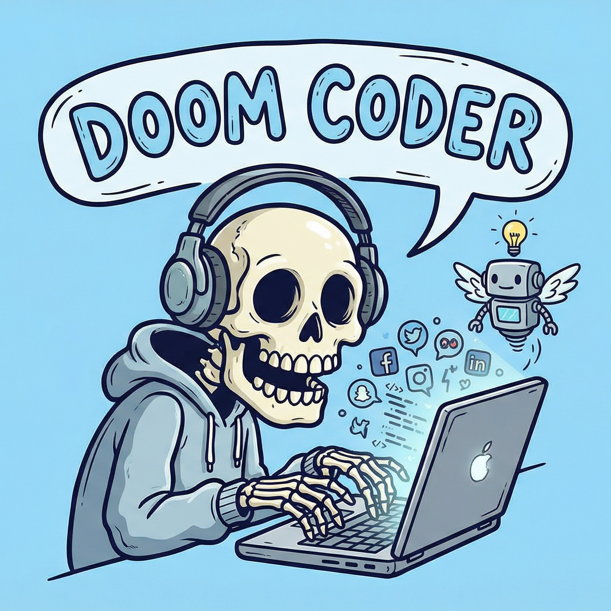

<div align="center">



# ⚡ Doom Coder

**Keep your Mac alive while AI agents do the work.**

[](https://github.com/katipally/Doom-Coder/releases/latest)
[](LICENSE)
[](#)
[](#)

</div>

---

## What is Doom Coder?

**Doom Coder** is a tiny macOS menu bar utility that prevents your Mac from sleeping — and protects your hardware while doing it.

The name is a mashup of two modern developer habits:
- **Doom scrolling** — mindlessly scrolling your phone while waiting for something
- **Vibe coding** — letting AI agents (Cursor, Claude Code CLI, GitHub Copilot) write the code while you watch

When you kick off a long AI task and walk away, macOS decides it's a great time to sleep. The AI agent then freezes, your terminal session dies, and you come back to a failed task. **Doom Coder fixes this.**

---

## How it works

When enabled, Doom Coder holds an `IOPMAssertion` with type `PreventUserIdleDisplaySleep` — a kernel-level flag that tells macOS "a user process needs the display and system awake." This is the exact same mechanism used by apps like Amphetamine and Lungo.

- ✅ **Zero CPU overhead** — it's one flag in the kernel, no polling, no timers
- ✅ **Zero memory overhead** — the app uses < 10 MB
- ✅ **Auto-released** — if Doom Coder crashes, the kernel automatically releases the assertion
- ✅ **No system settings modified** — everything is reverted the moment you disable it or quit

---

## Features

### Core
- **Menu bar only** — no Dock icon, no clutter (uses `LSUIElement = YES`)
- **One-click toggle** — bolt icon when active, slashed bolt when inactive
- **Elapsed time** — shows "Active for 2h 34m" so you know how long it's been running
- **Global hotkey ⌥ Space** — toggle without clicking the menu bar (requires Accessibility permission — grant it in Settings)

### Two Modes
- **Full Mode** — screen stays on at full brightness; prevents idle sleep entirely
- **Screen-Off Mode** — smoothly fades the display off (0.8 second cinematic transition) while keeping the Mac and all running processes fully alive; display wakes on any user input, then re-arms after a few minutes of idle

### Active Apps Window
- **Dynamic discovery (v0.6.0)** — scans all `$PATH` dirs, Homebrew, npm, Cargo, bun, nvm, Python bins, `/Applications`, and user-defined paths — no hardcoded list
- **App | Status | Signal | CPU%** table — live refresh every 10 seconds
- Three working signals: **procs** (child processes), **net** (network bytes via `proc_pidinfo`), **fs** (FSEvents file writes)
- **Scan button** — re-scans all installed and running tools on demand
- **Task completion notifications** — when a tracked tool transitions from working → idle, you get a macOS notification

### Settings Window
- **General tab** — Launch at Login toggle; Accessibility permission status + one-click "Grant Access" button
- **Tools tab (v0.6.0)** — add/remove custom CLI binary names and app bundle IDs; changes persist and trigger immediate re-scan

### Hardware Protection
- **Thermal monitoring** — real-time system thermal state shown in the Active Apps window footer: Normal / Fair / Serious / Critical
- **Session timer** — optional auto-disable after 1, 2, 4, or 8 hours with countdown display in the menu

### Other
- **Auto-updates** — powered by [Sparkle](https://sparkle-project.org/), updates delivered in the background
- **Settings persist** — all settings saved across app restarts
- **Open source** — MIT license, build it yourself

---

## ⚠️ Important: Gatekeeper Warning on First Launch

Doom Coder is **ad-hoc signed** but **not notarized** (notarization requires a $99/year Apple Developer account). macOS will show a security warning on first launch. This is **normal and expected** for all free, open-source Mac apps distributed outside the App Store without a paid certificate.

### macOS 15 (Sequoia) / macOS 26 and later

On macOS Sequoia and later, Apple removed the right-click bypass. Follow these steps:

1. Double-click `DoomCoder.app` — you'll see _"Apple could not verify..."_. Click **Done**.
2. Open **System Settings → Privacy & Security**
3. Scroll down to the **Security** section — you'll see a message that DoomCoder was blocked
4. Click **Open Anyway**
5. Enter your admin password and click **Open**

You only need to do this **once**. After that, it opens normally forever.

**Alternative — Terminal method (may also be needed on Sequoia+):**

```bash
xattr -cr /Applications/DoomCoder.app
open /Applications/DoomCoder.app
```

If the Terminal method alone still shows the warning, follow the System Settings steps above too.

### macOS 14 (Sonoma) and earlier

1. Right-click (or Control-click) `DoomCoder.app`
2. Select **Open** from the context menu
3. Click **Open** again at the security warning

### Why does this happen?

Apple's Gatekeeper blocks apps that aren't notarized through their paid Developer Program ($99/year). This is the same for _every_ open-source Mac app distributed outside the App Store — apps like [Raycast](https://raycast.com), [Rectangle](https://rectangleapp.com), and [IINA](https://iina.io) all require notarization or face the same warnings.

The source code is fully open in this repo. If you prefer, you can **build it yourself** — see [Building from Source](#building-from-source) below.

---

## Installation

### Option 1: Download (Recommended)

1. Go to [Releases](https://github.com/katipally/Doom-Coder/releases/latest)
2. Download `DoomCoder-x.x.x.zip`
3. Unzip and move `DoomCoder.app` to `/Applications`
4. Run the one-time Gatekeeper bypass (see above)
5. The `⚡` icon appears in your menu bar — you're ready

### Option 2: Build from Source

Requirements: Xcode 16+ and macOS 14.0+

```bash
git clone https://github.com/katipally/Doom-Coder.git
cd Doom-Coder
open DoomCoder.xcodeproj
```

In Xcode:
1. Select the `DoomCoder` target
2. Go to **Signing & Capabilities** → set your Apple ID team
3. Press **⌘R** to run

---

## Usage

| Menu item | Description |
|---|---|
| **Enable / Disable Doom Coder** | Toggle sleep prevention. Icon changes when active |
| **Active for Xh Xm** | How long Doom Coder has been running |
| **Mode: Full / Screen-Off** | Switch between the two operating modes |
| **Session Timer** | Auto-disable after 1/2/4/8 hours (optional) with countdown |
| **Active Apps…** | Opens the Active Apps window — installed AI tools with status and live CPU% |
| **Settings…** | Opens the Settings window — Launch at Login, Hotkey, Accessibility |
| **Check for Updates…** | Manually trigger a Sparkle update check |
| **About Doom Coder…** | Version info and description |
| **Quit Doom Coder** | Disables assertion and exits cleanly |

---

## Verifying it works (technical)

After enabling, run this in Terminal:

```bash
pmset -g assertions | grep DoomCoder
```

You should see output like:
```
pid 23409(DoomCoder): [0x000393ed00059a31] 00:11:36 PreventUserIdleDisplaySleep
named: "DoomCoder: Preventing sleep for AI coding session"
```

You can also check the summary:
```bash
pmset -g assertions | head -10
```

Look for `PreventUserIdleDisplaySleep    1` in the system-wide assertion status.

---

## Auto-Updates (Sparkle)

Doom Coder uses [Sparkle 2](https://sparkle-project.org/) for automatic updates.

- Updates are checked automatically in the background at launch
- You can also click **Check for Updates...** in the menu anytime
- Updates are cryptographically signed with EdDSA — only releases from this repo can be delivered
- The appcast feed lives at: [`appcast.xml`](https://raw.githubusercontent.com/katipally/Doom-Coder/main/appcast.xml)

---

## For Contributors / Release Process

### Setting up GitHub Actions

Releases are fully automated. Every time you push a version tag, GitHub Actions:
1. Builds the app
2. Ad-hoc signs every component (bottom-up: XPC services → Sparkle framework → main app)
3. Creates a `.zip` archive
4. Signs the ZIP with Sparkle EdDSA for secure updates
5. Updates `appcast.xml` in the main branch
6. Creates a GitHub Release with download instructions

**One-time setup:**

1. **Get your Sparkle private key** — the key was generated when setting up this project. To retrieve it:
   ```bash
   /path/to/Sparkle/bin/generate_keys -x /tmp/my_private_key.pem
   cat /tmp/my_private_key.pem
   ```
2. **Add it to GitHub Secrets:**
   - Go to your repo → **Settings** → **Secrets and variables** → **Actions**
   - Create a secret named `SPARKLE_PRIVATE_KEY`
   - Paste the private key (a single base64 string)

3. **Tag a release:**
   ```bash
   git tag v0.2.0
   git push origin v0.2.0
   ```
   The workflow triggers automatically.

### Project structure

```
DoomCoder/
├── DoomCoderApp.swift              # @main App entry, MenuBarExtra + Window scenes
├── SleepManager.swift              # IOPMAssertion, modes, screen-off fade, hotkey, session timer
├── AppDetector.swift               # Installed/running AI app tracking, CPU sampling
├── NotificationManager.swift       # UNUserNotificationCenter wrapper for idle notifications
├── MenuBarView.swift               # Menu UI: toggle, mode, timer, Active Apps…, Settings…
├── ActiveAppsView.swift            # Active Apps window: Table(App|Status|CPU) + thermal footer
├── SettingsView.swift              # Settings window: Launch at Login, Accessibility, Hotkey
├── CheckForUpdatesViewModel.swift  # Sparkle updater wrapper
└── AboutView.swift                 # About window with app icon
```

---

## Privacy

Doom Coder:
- ✅ Makes **zero** network requests (except Sparkle update checks to GitHub)
- ✅ Collects **no** user data
- ✅ Has **no** analytics, telemetry, or crash reporting
- ✅ Requests **no** permissions beyond what's needed for `IOPMAssertion`

---

## License

MIT License — see [LICENSE](LICENSE) for details.

Built with ❤️ for every developer who's been burned by macOS sleeping mid-agent.

---

<div align="center">
<sub>Doom Coder — because doom scrolling + vibe coding deserves better infrastructure.</sub>
</div>
