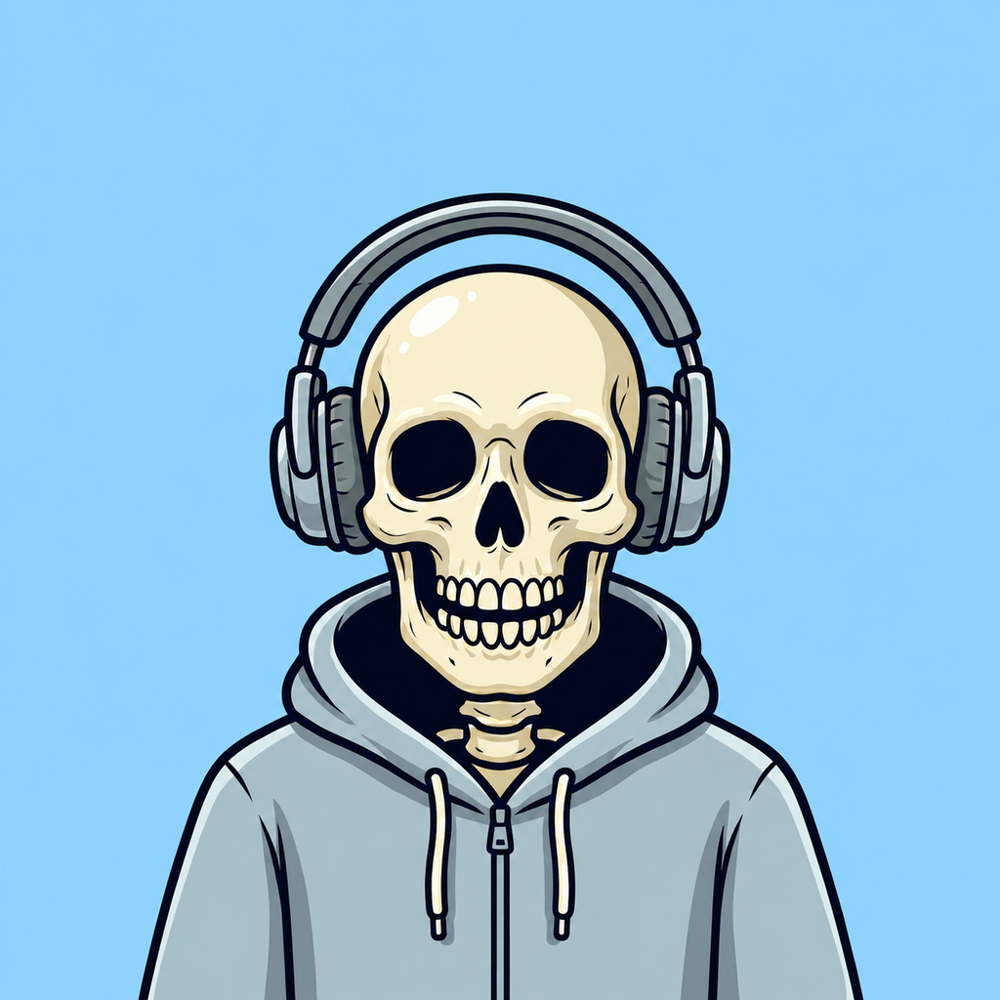

<div align="center">



# Doom Coder

**Keep your Mac awake. Watch your AI agents. Get pinged on your iPhone the second they need you.**

[](https://github.com/katipally/Doom-Coder/releases/latest)
[](https://github.com/katipally/Doom-Coder/actions/workflows/ci.yml)
[](https://github.com/katipally/Doom-Coder/releases)
[](https://github.com/katipally/Doom-Coder/stargazers)
[](LICENSE)
[](#)
[](#)
[](#)

<br/>

<table>
<tr>
<td align="center" valign="middle">
<a href="https://github.com/katipally/Doom-Coder/releases/latest"></a>
<br/>
<a href="https://github.com/katipally/Doom-Coder/releases/latest"></a>
<br/>
<sub><b>Doom Coder — the Mac app.</b> Signed & notarized <code>.dmg</code> from GitHub Releases (auto-updates via Sparkle).</sub>
</td>
<td align="center" valign="middle">
<a href="https://apps.apple.com/app/doomcoder-companion/id6772514212"></a>
<br/>
<a href="https://apps.apple.com/app/doomcoder-companion/id6772514212"></a>
<br/>
<sub><b>The iPhone & iPad companion.</b> Free on the App Store — pairs with the Mac app.</sub>
</td>
</tr>
</table>

<br/>

<sub>Once installed, press <kbd>⌥</kbd> <kbd>Space</kbd> (Option + Space) to open Doom Coder from anywhere. It also lives in your menu bar.</sub>

</div>

---

## Why I built this

I kept running into the same dumb problem.

I would kick off a long agent run, Claude Code or Codex chewing through a real task, and then go make coffee or look at my phone. Two things kept happening:

1. My Mac would fall asleep halfway through. The moment it sleeps, the network drops and the agent gets suspended, so the run just stalls. I'd come back to a black screen and an agent that had quietly stopped where it left off.
2. Or the agent would hit a permission prompt thirty seconds after I walked away and then just sit there. Frozen. Waiting on a single yes/no that I had no idea it was asking for. I'd come back ten minutes later to find it had done nothing the entire time.

So I was basically stuck babysitting the screen. I couldn't go do other work, couldn't leave the room, couldn't trust the run to survive without me staring at it. Which kind of defeats the point of having an agent do the work in the first place.

Doom Coder is the fix. It keeps the Mac awake so runs never die mid-task, and it watches your agents and sends a notification straight to your phone the moment one of them finishes, fails, or needs you to approve something. Now I can actually walk away. My phone buzzes when the agent needs a human, I tab back, unblock it, done.

The endgame I'm building toward: drive the whole thing from my phone. Send prompts, approve actions, steer the agent, all from my pocket so I don't even need to be at the laptop. We're not all the way there yet, but the foundation is shipping.

No accounts. No servers. No telemetry. Notifications travel through your own private iCloud container and nowhere else.

> **First time here?** Every control in the app has a hover tooltip (the ⓘ icon) that explains what it does. The full reference lives in [docs/features.md](docs/features.md).

---

## What it actually does

<video src="assets/Videos/Working_Demo.mp4" controls width="100%"></video>

Two jobs, done well.

**1. Keeps your Mac awake** while long-running stuff (builds, downloads, agent runs) finishes, without touching a single system setting. Nothing to clean up after.

**2. Watches your coding agents** (Claude Code, Cursor, VS Code Copilot, Copilot CLI, Windsurf, Codex CLI, and opencode) and notifies you the instant they finish, fail, or need your attention. On your Mac and on your iPhone, through the free **Doom Coder Companion** app.

---

## Keeping the Mac awake

<video src="assets/Videos/sleep.mov" controls width="100%"></video>

### Three modes

| Mode | What it does |
|---|---|
| **Off** | macOS handles sleep like normal. Doom Coder is running but holding nothing. |
| **On** | Always keeps the Mac awake. Pick **Screen On** (display stays lit) or **Screen Off** (display dims, CPU keeps going). |
| **Auto** | The smart one, Caffeine style. Stays awake while a tracked agent is actually working **or** while you're at the keyboard. Lets go 10 minutes after both go quiet. You can **Snooze** it (15 min, 1 hour, or until you turn it off) when you want to override that. Honors your per-agent tracking toggles. |

Switch modes from the menu bar panel. **Option Space** pops it open from anywhere.

### Screen modes (when Keep-Awake is On)

| Mode | What it does |
|---|---|
| **Screen On** | Display stays fully lit. Mac never sleeps. Good for glancing at progress. |
| **Screen Off** | Display sleeps after a short delay, Mac CPU stays awake. Saves power, less screen burn. |

### Session timer (when Keep-Awake is On)

Auto-shutoff after **1, 2, 4, or 8 hours**, or leave it running forever. Tap a duration tile in the panel to set it.

### Screen Off re-arm

In Screen Off mode, moving the mouse wakes the display. Doom Coder puts it back to sleep automatically after an idle gap you choose (default **10 minutes**). Tune it in **Configure > Settings > Screen Off**.

### Auto mode snooze

When Auto is active, a **Snooze** pill shows up under the Off/On/Auto control. Tap it to force the Mac awake for:

- **15 minutes** for a quick coffee break
- **1 hour** for a meeting or a call
- **Until I turn it off** for an open-ended hold, like Caffeine

While snoozed, the panel shows a countdown and the menu bar icon swaps to a `moon.zzz.fill`. Cancel any time from the same menu or from your phone. The iOS app mirrors the snooze with a live countdown too.

---

## How the sleep blocker works

Doom Coder holds an `IOPMAssertion`, the exact same kernel flag that Amphetamine, Lungo, and `caffeinate` use.

- Basically zero CPU and under 10 MB RAM. It's one flag in the kernel, no polling loop.
- Released automatically on crash, quit, or disable.
- No system settings changed, so there's nothing to undo.
- Session timer to auto-disable after 1, 2, 4, or 8 hours.
- Launch at Login if you want it.
- Sparkle auto-updates.
- Global hotkey (Option Space, rebindable).

---

## Watching your agents

<video src="assets/Videos/multiple_agents.mov" controls width="100%"></video>

### Supported agents

Each agent emits a different set of events. The headline ones (done, failed, waiting on you) are below. On top of these, most agents also emit quieter activity events (tool calls, file edits, sub-agents, thinking, context compaction) that you can opt into per agent.

| Agent | Key events | Config location |
|---|---|---|
| **Claude Code** | Completed, failed, waiting approval, waiting input, session start | `~/.claude/settings.json` |
| **Cursor** | Completed, failed, waiting approval, waiting input, session start | `~/.cursor/hooks.json` |
| **VS Code Copilot** | Completed, failed, waiting approval, session start | `~/.copilot/vscode-hooks/doomcoder.json` |
| **Copilot CLI** | Completed, failed, waiting approval, session start | `~/.copilot/hooks/doomcoder.json` |
| **Windsurf** | Completed, waiting approval, waiting input | `~/.codeium/windsurf/hooks.json` |
| **Codex CLI** | Completed, waiting approval, session start | `~/.codex/hooks.json` |
| **opencode** | Completed, failed, waiting approval, session start | `~/.config/opencode/plugin/doomcoder.js` |

VS Code hooks cover multiple variants at once: VS Code Stable, VS Code Insiders, VSCodium, Cursor, and Windsurf. Pick which `settings.json` files to patch in **Configure > VS Code**.

### How the hooks work

Doom Coder drops a tiny `dc-hook` binary into each agent's hook config. When an agent fires a hook event, `dc-hook` writes a small JSON envelope to a Unix socket that Doom Coder is listening on. The binary lives in `~/Library/Application Support/DoomCoder/dc-hook` so it survives app moves and Xcode rebuilds.

opencode is the one exception in how it's wired: instead of a hooks JSON file, Doom Coder installs a small JavaScript plugin (`doomcoder.js`) that opencode auto-loads. The plugin still calls the same `dc-hook` over the same socket, so it lands in exactly the same place as every other agent.

That's the whole trick. No polling, no guessing, no scraping logs. The agent tells you exactly when something happens, and you find out in real time.

### Setting it up

1. Open the panel (click the menu bar icon or hit **Option Space**).
2. Click **Configure** in the Agent Tracking card.
3. Pick an agent in the sidebar.
4. Check the prerequisites, then click **Install**.
5. The green health dot in the sidebar means events are flowing.

Doom Coder backs up your config before it writes anything, and it can **Repair** hooks if they ever drift out of sync.

### Per-agent toggles

Open **Track Agents** from the main panel to:
- Turn notifications on or off per agent without uninstalling the hooks.
- **Pause everything** for a bit. The Pause toggle is in-memory only, so it resets when Doom Coder quits.

Events still get logged locally even while an agent is paused or off.

---

## Connections

The **Connections** tab (in the Configure window) is where notifications get delivered and where you see every device paired to this Mac.

### Connected devices

Each iPhone or iPad running the companion sends a quiet presence heartbeat to your private iCloud container. The Mac marks a device **Connected** if it checked in within the last 10 minutes, or **Last seen X ago** otherwise. It's symmetric with how the phone shows your Mac's status. If nothing has checked in, a **Set up iPhone or iPad** button links you to the App Store.

### macOS notifications

Plain old macOS banners. Grant permission once and they work everywhere.

### iPhone and iPad (iCloud)

Needs the free **Doom Coder Companion** app. Notifications hit your phone in 1 to 5 seconds through your private iCloud container. No third-party server, no tokens.

Pairing is dead simple and works two ways:

- **Same Apple ID on both devices?** Nothing to do. Open the companion signed into the same iCloud account and your Mac shows up automatically under the Dashboard tab.
- **Different Apple ID?** (your phone is on a work or personal account that's separate from the Mac) Open **Add Device** on the Mac, then scan the QR code with your phone's camera or send yourself the invite link. This shares just this Mac's notifications to that device through a private CloudKit share.

### Picking which events alert you

<video src="assets/Videos/notification customization.mov" controls width="100%"></video>

Each agent's detail pane has a **"What you'll be notified about"** card. Tap **Edit** to choose exactly which events ping you, grouped so it stays readable:

| Group | Categories | Default |
|---|---|---|
| **Important** | Completed, Failed, Waiting for approval, Waiting for input | On |
| **Activity** | Session started, Tool calls, Sub-agent activity, File edits, Thinking, Prompt sent | Off |
| **Housekeeping** | Context compaction, Background tasks | Off |

You only see toggles for events an agent can actually emit, so nothing on screen is dead weight. The permission categories expand into a per-tool list, so you can get pinged before a shell command runs but stay quiet for file reads.

### No more auto-accept spam

Copilot CLI, Cursor, and Windsurf fire a *permission* hook **before** their own allowlist decides to auto-approve something. A naive watcher would ping you for tools that were never actually blocked. Doom Coder waits out a short **approval debounce window** (default 0.8s, adjustable 0.5 to 3s under **Configure > Settings**) for proof the tool actually ran, so only genuinely-blocking requests make a sound. Live status in the menu bar and Dynamic Island is never delayed. Agents with reliable hooks (Claude Code, VS Code Copilot, Codex) alert instantly with zero added lag.

### Connections are global

One **mac + iPhone** channel setting covers every agent. Per-agent channel overrides got removed because they added complexity without paying for it. Per-agent control now lives in the *categories* card above.

---

## The iPhone and iPad companion

**Doom Coder Companion** (iOS 26+) is a real standalone app, not just a notification mirror. Fully usable the second you open it, no setup. No Mac connection, no API key, no account needed.

It has four tabs: **Dashboard**, **Prompts**, **Notes**, and **Settings**. Prompts and Notes work fully on-device with nothing else set up. Dashboard is where your Mac shows up once you pair one.

### Works with zero setup

**Prompts tab.** A prompt refiner, not a chatbot. You type a rough, half-formed request and the AI rewrites it into a clean, structured prompt you can paste into your actual agent. It streams the rewrite back in an iMessage-style thread, and you can keep refining over follow-up turns. Every session auto-saves, and the History button up top lets you jump between past ones. The Library button opens a stack of ready-made dev prompts grouped by category (Refactor, Tests, Debug, Review, Explain, Git, Docs, Scaffold). Tap any one to drop it into the composer or copy it. The library works with zero AI and zero Mac.

**Notes tab.** On-device notes with a title, body, inline task checklists, reminders (local notifications), pinning, and search. Turn any note into a prompt with one tap, which seeds a fresh refine session over in the Prompts tab. Runs fully on-device, no network.

**Prompt Enhance (AI).** The rewrite engine runs on Apple's on-device model (nothing leaves your phone) or, if you'd rather, your own API key from **OpenAI or Anthropic** (bring your own key, stored in the device Keychain). If on-device AI isn't available on your device, the app says so up front and points you at Settings. Enhance is optional. Browsing the library, writing notes, and copying prompts never need it.

### What you get once you pair a Mac

Pair it (same Apple ID is automatic, different Apple ID uses the QR or invite link from the Mac's Add Device sheet). Then the **Dashboard** tab mirrors the Mac panel live:
- The agent list with status (running, waiting, idle, failed), tap any one for its notification log
- Master on/off and the full keep-awake controls (Off / On / Auto, Screen On / Off, the auto-off timer, and Snooze) all drivable from your phone
- A notification log per agent with full event detail

Commands you send from the phone are confirmed back by the Mac, so the controls reflect what actually happened, not just what you tapped. If your Mac stops checking in, the app tells you it might be out of date instead of showing stale state.

Notifications land on your phone within 1 to 5 seconds of the agent event, through your private iCloud container.

[Get it on the App Store](https://apps.apple.com/app/doomcoder-companion/id6772514212)

---

## Settings reference

| Setting | Default | Where |
|---|---|---|
| Launch at Login | Off | Configure > Settings > General |
| Global hotkey | Option Space | Configure > Settings > General |
| Screen Off re-arm interval | 10 min | Configure > Settings > Screen Off |
| Auto-revert completed sessions | 30 s | Configure > Settings > Session Lifecycle |
| Redact prompt text in local history | On | Configure > Settings > Notifications & Privacy |

Full details: [docs/features.md](docs/features.md)

---

## Logs and diagnostics

All of this lives in the **Activity** tab of the Configure window.

- **Live events.** A real-time stream of hook events per agent, with a Sessions view (grouped by agent and date), a Raw firehose, and a Notifications view.
- **Browse and export.** Filter by agent, expand any row to see the full JSON payload, and export the current view to JSON or CSV. Retention is adjustable (1, 7, or 30 days, default 7).
- **Raw log files.** Stored in `~/Library/Logs/DoomCoder/`, kept for 7 days. Hit **Reveal Logs** in Configure > Settings > Diagnostics.
- **Connection Doctor.** Fires a fake test event through the whole pipeline end to end to prove your hooks actually work.

---

## Install

Grab the latest `.zip` from [Releases](https://github.com/katipally/Doom-Coder/releases/latest), unzip it, drag `DoomCoder.app` into `/Applications`, and double-click to open.

Doom Coder is signed with an Apple Developer ID and notarized by Apple, so there are no Gatekeeper prompts and no Terminal workarounds.

On first launch, macOS might ask for Accessibility permission. That's only for the **Option Space** global shortcut. Skip it if you don't care about the hotkey.

---

## Build from source

```bash
git clone https://github.com/katipally/Doom-Coder.git
cd Doom-Coder
open DoomCoder.xcworkspace
```

Needs Xcode 26, macOS 26, Swift 6. Sparkle is pulled in over SPM.

The iOS companion lives in `DoomCoderCompanion/` and is generated from a spec file. Run `cd DoomCoderCompanion && xcodegen generate` (install it with `brew install xcodegen`) before opening it.

---

## Contributing

This is an open-source project and contributions are genuinely welcome, whether that's a bug report, a feature idea, or code.

- **Found a bug?** [Open a bug report.](https://github.com/katipally/Doom-Coder/issues/new?template=bug_report.yml)
- **Have an idea?** [Open a feature request.](https://github.com/katipally/Doom-Coder/issues/new?template=feature_request.yml) Adding support for a new agent is always interesting.
- **Want to write code?** Read [CONTRIBUTING.md](CONTRIBUTING.md) for setup, the project layout, and how to open a PR.
- **Found a security hole?** Don't post it publicly. See [SECURITY.md](SECURITY.md).

Every pull request runs through CI automatically: it builds the Mac app, builds the iOS companion, and runs SwiftLint. All three need to pass. Be kind to each other, the [Code of Conduct](CODE_OF_CONDUCT.md) is short.

---

## Privacy

Doom Coder collects no analytics, sends nothing to any server, and runs no telemetry. The full policy is in [docs/privacy.md](docs/privacy.md).

---

## Contact

Built by Yashwanth Reddy Katipally.

- Email: yashwanthreddykatipally@gmail.com
- LinkedIn: [linkedin.com/in/yashwanth-katipally](https://linkedin.com/in/yashwanth-katipally)

---

## License

MIT. See [LICENSE](LICENSE).
